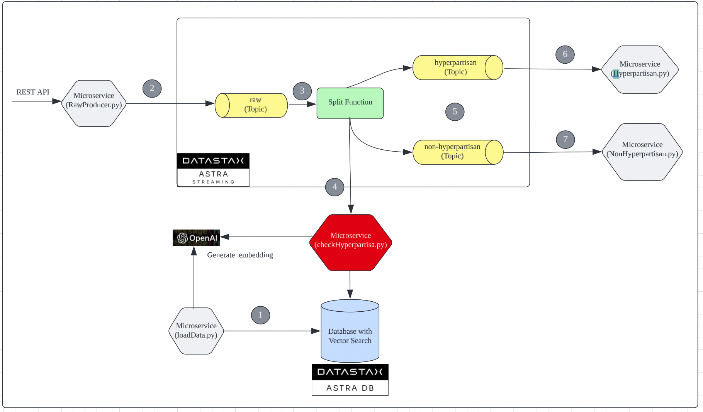
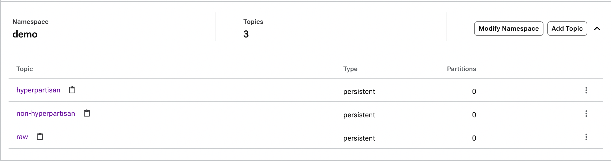
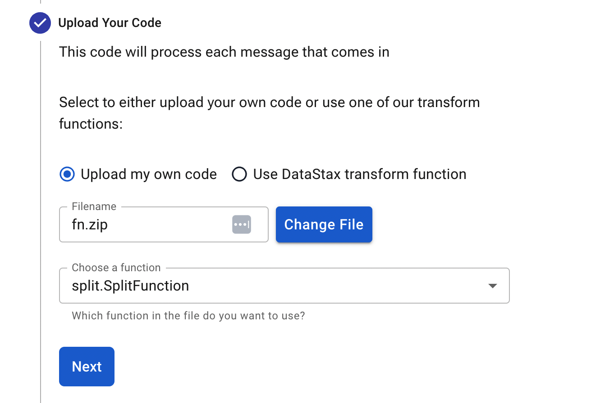
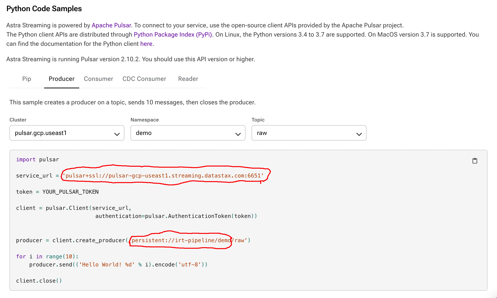

# Overview 

This project is to share the implementation of Real-Time AI Solution with Vector Search.    The use case is about detecting hyperpartisan news contents.  Instead of using [traditional train model](https://towardsdatascience.com/train-a-longformer-for-detecting-hyperpartisan-news-content-7c141230784e) approach,  use the [trained data](https://huggingface.co/datasets/hyperpartisan_news_detection) and Vector Search to faster search the closest data based on embedding and predict the possibility that the news content is hyperpartisan and take necessary action on it (e.g. Take it down from website).

Just for illustration.  The application will just consume the messages with hyperpartisan content and print the content.

Please note that Python 3.10 is used to run/test this whole application. 

# Architecture 

Below is the architecture of this application.   



# Pre-requisites

* Register to [Astra](http://astra.datastax.com) and create your Vector Search DB which is currently only available in Google US-EAST 1.  Please take note of the keyspace name that used for the creation. 
* Download the secure bundle after the database is created successfully.  This zip file will be used in different places.    
* Create a token with permissions to create tables.  The generated token is a json that contains the `clientId` as the Cassandra User and `secret` as the Cassandra Password. 
* Get key from OpenAI to generate embedding.  
* Create a Astra Streaming instance (Preferred same region as database.)

# Steps to setup and run application

Please follow the steps below to setup and run the application.   

## Step 1: Load Trained Data and Deploy Service to check if the content is hyperpartisan.  

The [data]((https://huggingface.co/datasets/hyperpartisan_news_detection)) need to be loaded into Astra DB with Vector Search.

* Put the download secure bundle zip file under the `setup` folder. 

* Under the `setup` folder,  rename `.env.sample` to `.env` and update the environment variable according to the values under `pre-requisites`.    Please **do not change** the value of `table`

* Load the required modules to run this. 
```
sh loadModules.sh
```

* Run loadData.py to load data into Astra with Vector Search.    This job will create `news` table with the required SAI index.   This will takes sometimes (e.g. < 21mins) to load the data as pause is implemented as rate limit is set as 60/per min if using free trial OpenAPI.
```
python3.10 loadData.py
``` 
* Please note that I'm using Google Run to run the service.   If you are using others to run the service, please skip the step below and deploy the service in your own way. 

* Next,  it is to deploy service to check if the content is hyperpartisan. Before deploying to Google Run,  you need to change the path to point to your gcloud cli in deploy.sh before running deploy.sh.   
```
sh deploy.sh
```
## Create topics 
* Go back to Astra Console and click on the Astra Streaming Instance. 

* Click on `Namespace and Topics` tab.

* Click on `Create Namespace` button.  Name it as `demo`.

* Create the following topics under `demo`.  Set as `Persistent`.  
** raw 
** hyperpartisan
** non-hyperpartisan

* Under the `fn` folder,  put the download secure bundle zip file. 

* Under the same folder,  rename `.env.sample` to `.env`.  

* Copy the full name of each topics (hyperpartisan, non-hyperpartisan) and paste into the environment variables(hyperpartisan_topic, nonhyperpartisan_topic) in .env under `fn` folder.


* Replace `api_url` with your application URL. 

## Configure Function

* Under the `fn` folder, run the command below to load the required modules.
```
sh loadModules.sh
```

* Under the same folder,  run the command below to package this function and a fn.zip will be generated. 
```
sh package.sh
```

* Go back to Astra Console and click on the Astra Streaming Instance.

* Click on `Functions` tab.  Click on `Create Function` button.

* Specify a name and select namespace as `demo`.  Click `Next`. 

* Upload the generated `fn.zip` and select function as `split.SplitFunction`.  Click `Next`.


* Select `Input Topic` as `raw` under `demo` namespace.  Click `Next`.

* Click `Create`.

* Please wait for the status to be `running`. 

## Get Astra Streaming Information

* Get the information to connect Astra Streaming via Consumer / Producer.  

* Go back to Astra Console and click on the Astra Streaming Instance.

* Click on `Connect` tab. Click on `Python`.   

* Click on `Producer` tab and select `demo` as namespace and `raw` as topic.  These information will be used to configure .env file.


* Click on `Settings` tab. Copy the token.   It will be used to configure .env file. 
./images/token.png)

* Under the `streaming` folder,  rename `.env.sample` to `.env`. Replace the `service_url`, `token` and `namespace`.   Please note to stop at `/demo`

* Please **do not change** the value of `PORT`.

## Start Consumer 

* Under the `streaming` folder, run the command below to consumer message from `hyperpartisan` topic.
```
python3.10 ./src/Hyperpartisan.py
```

* Under the same folder, run the command below to consumer message from `non-hyperpartisan` topic.
```
python3.10 ./src/NonHyperpartisan.py
```

## Start Producer

* Under the `streaming` folder, run the command below to run Producer as a service to consume news content.
```
python3.10 ./src/RawProducer.py
```
* Access the service via http://localhost:8080/write with any of the payload below. 

* The sample payload below is hyperpartisan news content. 
```
{"id": "1234", "content": "A combative President Trump launched an urgent, last-ditch bid Wednesday to revive an Obamacare repeal effort that had been left for dead just 24 hours earlier, imploring Republicans to stay in Washington until the job is done and warning that failure would decimate the party and its agenda.I'm ready to act, Mr. Trump said at the White House. For seven years you've promised the American people that you would repeal Obamacare. People are hurting. Inaction is not an option. The urgent public plea marked a confrontational shift in tone for Mr. Trump, who had been lobbying senators mainly behind the scenes, and a renewed commitment to the effort. One day earlier,Mr. Trump said Republicans should force Democrats to own Obamacare by letting it collapse under its unsustainable weight.SEE ALSO: Trump hosting GOP senators at White House on Obamacare repeal Mr. Trump got personal at times, leaning into Sen. Dean Heller, a Nevada Republican who faces a tough re-election battle next year and is wary of backing the repeal-and-replace effort.", "title": " President Trump launched an urgent, last-ditch bid", "url": "https://towardsdatascience.com/train-a-longformer-for-detecting-hyperpartisan-news-content-7c141230784e",  "publish_at" : "2023-07-10"}
```

* The sample payload below is non-hyperpartisan news content. 
```
{"id": "4455", "content": "A tropical depression off the Gulf Coast of Florida was upgraded to a tropical storm on Monday, the National Hurricane Center said. The storm was designated Tropical Storm Emily on Monday morning &#8212; the fifth named storm of the 2017 Atlantic hurricane season. Emily is moving eastward with strong winds at about 8 mph, and is expected to bring very heavy rain to south and central Florida in the coming days. Monday, officials said 60 mph winds forced the closure of the Sunshine Skyway Bridge in St. Petersburg and caused some infrastructure damage. No serious injuries have yet been reported. A <a href=\"http://www.sun- sentinel.com/news/weather/fl-reg-tropics-monday-20170731-story.html\">tropical storm warning</a> was issued early Monday for the west coast of Florida, from Anclote River southward to Bonita Beach. The tropical storm made landfall at about 10:45 a.m., on Anna Maria Island, near Bradenton. Emily is expected to turn northeast as it passes over the state, indicating central Florida will receive much of the expected rain. The storm is expected to move offshore to the Atlantic Ocean by early Tuesday. Rain accumulations of two to four inches are predicted for the state&#8217;s west coast, the <a href=\"http://www.nhc.noaa.gov/text/refresh/MIATCPAT1+shtml/311139.shtml\">National Hurricane Center</a> said, with isolated amounts of up to eight inches possible", "url": "https://towardsdatascience.com/train-a-longformer-for-detecting-hyperpartisan-news-content-7c141230784e",  "publish_at" : "2023-07-10"}
```


